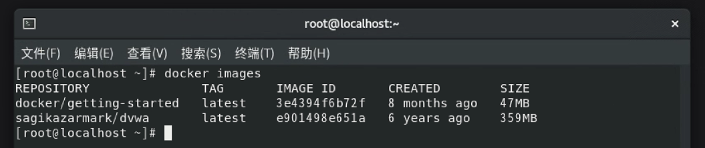
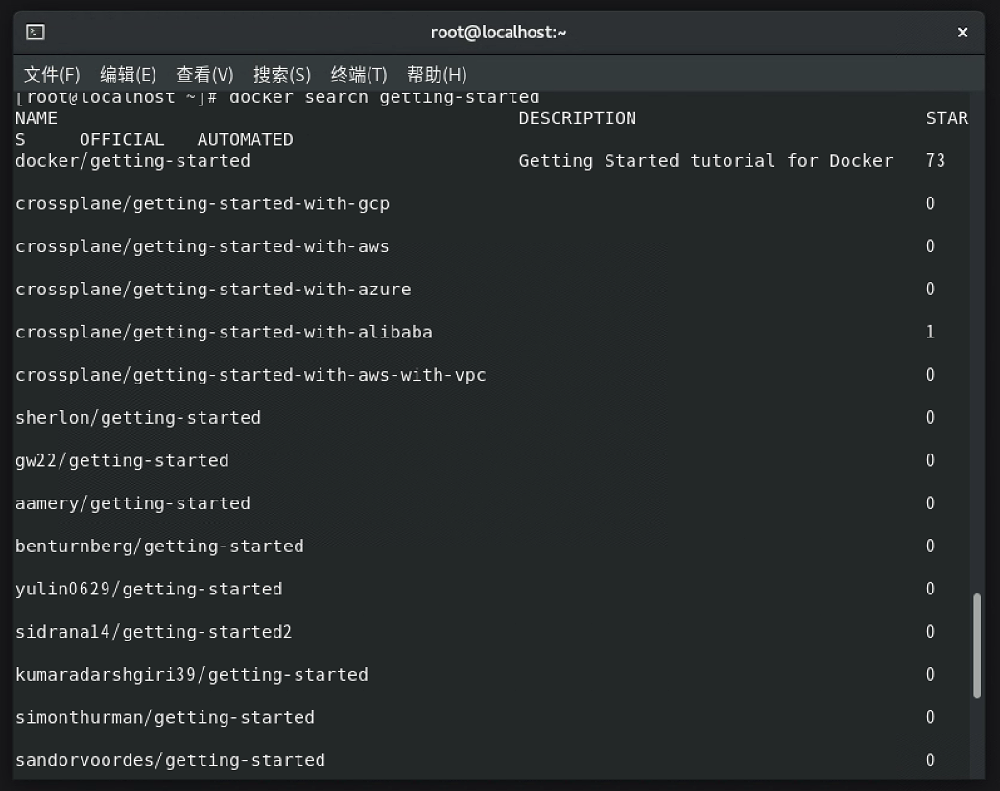
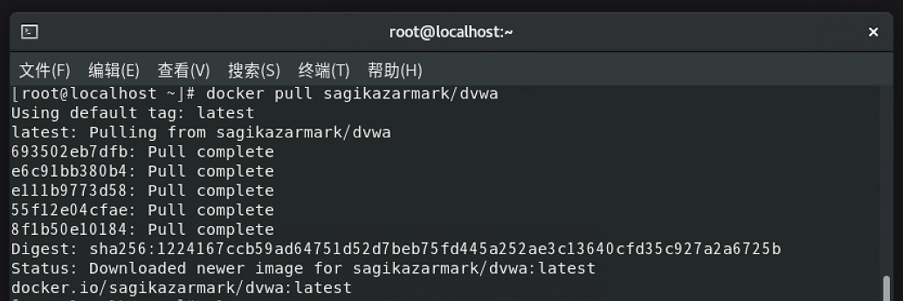
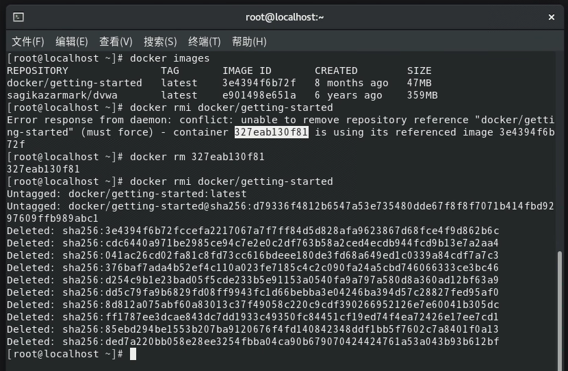

一、判断题

Java 是编译型语言。    (×)  
Javascript 中，不区分大小写字母，也就是说 A 和 a 是同一个变量。    (×)  
Javascript 中的常量包括 String、Number、Boolean、Null、Undefined。    (×)  
String 字符串的语法中既可以使用单引号，也可以使用双引号。    (√)  
typeof 是用来判断变量类型，不可以当作运算符使用。    (×)  
任何值和 undefined 运算，undefined 可看做 0 运算。    (×)  

二、请分别描述下列代码中“+”的作用。

console.log(“年龄:” + 20);    // 字符串拼接符  
console.log(11+22+33);    // 算术运算符  
console.log(“网络 + 安全”);    // 字符串中的字符  
var a = 1;  
var b = 2;  
console.log(“a” + b);    // 字符串拼接符  
var a = 1;  
var b = 2;  
console.log(“a + b”);    // 字符串中的字符  

三、计算下述代码的打印值
var a = 10;  
var b = 10;  
console.log(a++);    // 10  
console.log(++a);    // 12  
console.log(--b);    // 9  
console.log(b--);    // 9  

四、分别使用行内式、内嵌式、引入外部文件的方法造成网页弹窗，要求触发弹窗的 JavaScript 命令不止一种（alert、print、prompt）。

行内式：[demo1.html](https://github.com/mixstark/GeekTimeWorkspace/blob/main/02/demo/demo1.html)  
内嵌式：[demo2.html](https://github.com/mixstark/GeekTimeWorkspace/blob/main/02/demo/demo2.html)  
引入外部文件：[demo3.html](https://github.com/mixstark/GeekTimeWorkspace/blob/main/02/demo/demo3.html)  

五、安装 Docker 并练习以下基础命令、帮助命令、镜像命令和容器命令:

1. 帮助命令  
docker 命令 --help
```shell
[root@localhost ~]# docker --help

Usage:  docker [OPTIONS] COMMAND

A self-sufficient runtime for containers

Common Commands:
  run         Create and run a new container from an image
  exec        Execute a command in a running container
  ps          List containers
  build       Build an image from a Dockerfile
  pull        Download an image from a registry
  push        Upload an image to a registry
  images      List images
  login       Log in to a registry
  logout      Log out from a registry
  search      Search Docker Hub for images
  version     Show the Docker version information
  info        Display system-wide information

Management Commands:
  builder     Manage builds
  buildx*     Docker Buildx (Docker Inc., v0.11.2)
  compose*    Docker Compose (Docker Inc., v2.20.2)
  container   Manage containers
  context     Manage contexts
  image       Manage images
  manifest    Manage Docker image manifests and manifest lists
  network     Manage networks
  plugin      Manage plugins
  system      Manage Docker
  trust       Manage trust on Docker images
  volume      Manage volumes

Swarm Commands:
  swarm       Manage Swarm

Commands:
  attach      Attach local standard input, output, and error streams to a running container
  commit      Create a new image from a container's changes
  cp          Copy files/folders between a container and the local filesystem
  create      Create a new container
  diff        Inspect changes to files or directories on a container's filesystem
  events      Get real time events from the server
  export      Export a container's filesystem as a tar archive
  history     Show the history of an image
  import      Import the contents from a tarball to create a filesystem image
  inspect     Return low-level information on Docker objects
  kill        Kill one or more running containers
  load        Load an image from a tar archive or STDIN
  logs        Fetch the logs of a container
  pause       Pause all processes within one or more containers
  port        List port mappings or a specific mapping for the container
  rename      Rename a container
  restart     Restart one or more containers
  rm          Remove one or more containers
  rmi         Remove one or more images
  save        Save one or more images to a tar archive (streamed to STDOUT by default)
  start       Start one or more stopped containers
  stats       Display a live stream of container(s) resource usage statistics
  stop        Stop one or more running containers
  tag         Create a tag TARGET_IMAGE that refers to SOURCE_IMAGE
  top         Display the running processes of a container
  unpause     Unpause all processes within one or more containers
  update      Update configuration of one or more containers
  wait        Block until one or more containers stop, then print their exit codes

Global Options:
      --config string      Location of client config files (default "/root/.docker")
  -c, --context string     Name of the context to use to connect to the daemon (overrides DOCKER_HOST env var and
                           default context set with "docker context use")
  -D, --debug              Enable debug mode
  -H, --host list          Daemon socket to connect to
  -l, --log-level string   Set the logging level ("debug", "info", "warn", "error", "fatal") (default "info")
      --tls                Use TLS; implied by --tlsverify
      --tlscacert string   Trust certs signed only by this CA (default "/root/.docker/ca.pem")
      --tlscert string     Path to TLS certificate file (default "/root/.docker/cert.pem")
      --tlskey string      Path to TLS key file (default "/root/.docker/key.pem")
      --tlsverify          Use TLS and verify the remote
  -v, --version            Print version information and quit

Run 'docker COMMAND --help' for more information on a command.

For more help on how to use Docker, head to https://docs.docker.com/go/guides/
```

2. 镜像命令  
docker images 列出所有镜像  

docker search 搜索镜像  

docker pull 下载镜像  

docker rmi 删除镜像  

