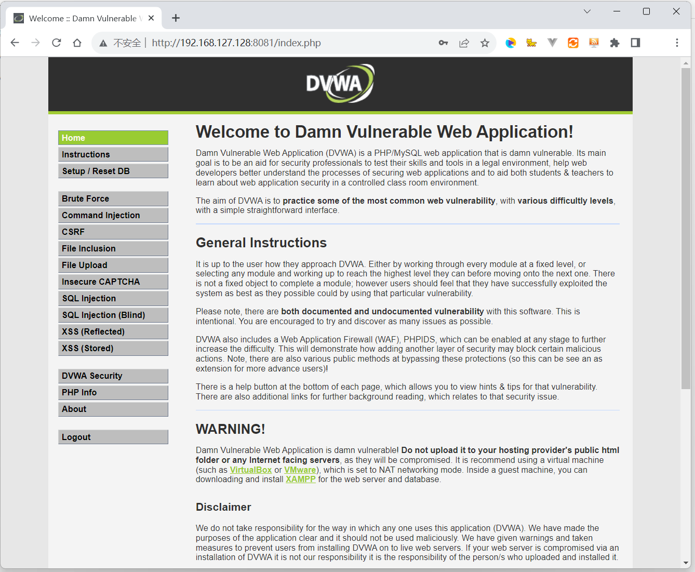
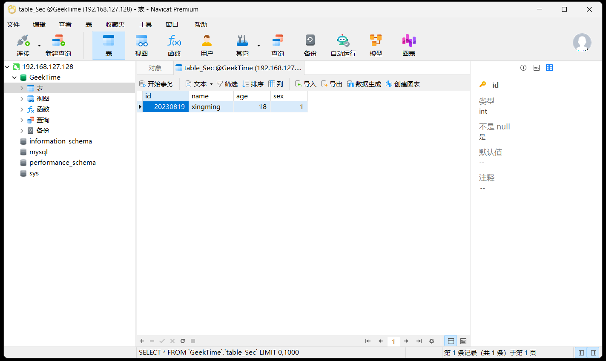

1、在 docker 中分别以后台方式和交互方式启动 centos，对比启动后的容器状态，实现退出容器也能保持其运行状态。  

```shell
# 以后台方式启动 centos
docker run centos -d
# 以交互方式启动 centos
docker run -it centos /bin/bash
```

2、在 docker 并部署 DVWA，要求：DVWA web 端口映射到 8081，提供访问截图。  



3、Mysql 练习  

（1）创建一个名为 "GeekTime"的数据库；  

```sql
create database GeekTime charset utf8mb4 collate utf8mb4_general_ci;
```

（2）在 GeekTime 数据库中创建一张名为"table_Sec"的表，要求有序号、姓名、年龄、性别字段；  

```sql
use GeekTime;
create table table_Sec(
    id int primary key auto_increment,
    name varchar(255),
    age int,
    sex int
);
```

（3）在 table_Sec 表中插入数据，序号是 20230819，姓名是拼音缩写，年龄、性别无要求;  

```sql
insert into table_Sec values(20230819, "xingming", 18, 1);
```

（4）使用 Navicat 连接你所创建的数据库，查看个人信息并提供截图。  


